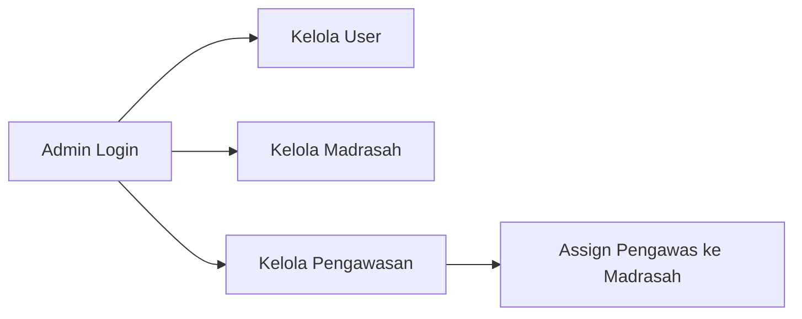
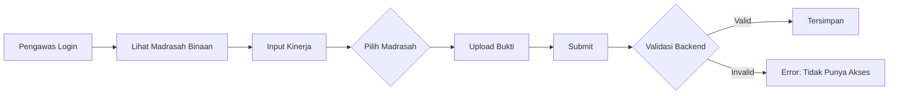
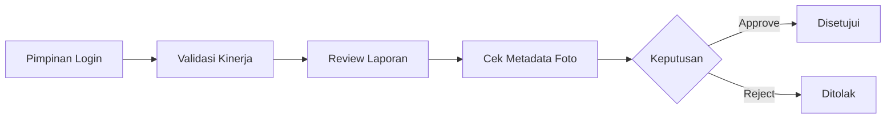

# 📊 Aplikasi Kinerja Pengawas Kementerian Agama Kabupaten Jombang

Sistem informasi untuk mengelola dan memantau kinerja pengawas madrasah di Kabupaten Jombang, dengan fitur assignment madrasah, validasi berbasis GPS dan timestamp, serta pelaporan komprehensif.

## 🎯 Fitur Utama

### 1. **Manajemen Pengawasan Madrasah**
- ✅ Admin dapat meng-assign pengawas ke madrasah tertentu
- ✅ Satu madrasah hanya bisa diawasi oleh satu pengawas aktif
- ✅ Satu pengawas bisa mengawasi beberapa madrasah
- ✅ Dropdown searchable untuk memilih madrasah (Select2)
- ✅ Accordion layout untuk tampilan yang compact

### 2. **Input Kinerja Pengawas**
- ✅ Pengawas hanya bisa input kinerja untuk madrasah yang di-assign
- ✅ Upload bukti fisik dengan ekstraksi EXIF (timestamp & GPS)
- ✅ Validasi backend untuk mencegah manipulasi
- ✅ Soft validation untuk foto tanpa metadata

### 3. **Validasi Kinerja (Pimpinan)**
- ✅ Review dan validasi laporan kinerja
- ✅ Lihat metadata foto (timestamp, GPS coordinates)
- ✅ Approve/reject dengan keterangan
- ✅ Filter berdasarkan status validasi

### 4. **Laporan & Rekap**
- ✅ Laporan kinerja per periode (bulan/tahun)
- ✅ Filter berdasarkan pengawas
- ✅ Total poin kredit otomatis
- ✅ Export/print friendly
- ✅ Data terbaru muncul di atas (DESC order)

### 5. **Manajemen User & Madrasah**
- ✅ CRUD user (Admin, Pengawas, Pimpinan)
- ✅ CRUD data madrasah
- ✅ Role-based access control

## 🏗️ Teknologi

- **Backend:** PHP Native (7.4+)
- **Database:** MySQL/MariaDB
- **Frontend:** Bootstrap 5, FontAwesome, Select2
- **Library:** EXIF Reader (PHP), jQuery

## 📦 Instalasi

### 1. Clone Repository
```bash
git clone https://github.com/yourusername/app-kinerja-pengawas.git
cd app-kinerja-pengawas
```

### 2. Setup Database
```bash
# Import database schema
mysql -u root -p < database.sql

# Jalankan migration untuk tabel pengawas_madrasah
mysql -u root -p kinerja_pengawas < create_pengawas_madrasah_table.sql

# Update constraint (opsional, jika sudah ada data)
mysql -u root -p kinerja_pengawas < update_unique_constraint.sql
```

### 3. Konfigurasi Database
Edit file `config/database.php`:
```php
<?php
return [
    'host' => 'localhost',
    'user' => 'root',
    'pass' => '',
    'name' => 'kinerja_pengawas'
];
```

### 4. Setup Web Server
- **XAMPP/Laragon:** Copy folder ke `htdocs` atau `www`
- **URL:** `http://localhost/app-kinerja-pengawas`

### 5. Login Default
```
Admin:
Username: admin
Password: admin123

Pengawas:
Username: pengawas1
Password: pengawas123

Pimpinan:
Username: pimpinan
Password: pimpinan123
```

## 🗂️ Struktur Folder

```
app-kinerja-pengawas/
├── assets/
│   ├── css/          # Stylesheet
│   ├── js/           # JavaScript
│   └── img/          # Images & icons
├── config/
│   └── database.php  # Database configuration
├── core/
│   ├── koneksi.php   # Database connection
│   ├── auth.php      # Authentication
│   └── functions.php # Helper functions
├── modules/
│   ├── admin/
│   │   ├── users/           # User management
│   │   ├── madrasah/        # Madrasah management
│   │   └── pengawasan/      # Assignment management
│   ├── kinerja/             # Performance input (Pengawas)
│   ├── validasi/            # Validation (Pimpinan)
│   ├── laporan/             # Reports
│   ├── madrasah/            # Madrasah Binaan Saya
│   └── dashboard/           # Dashboard
├── templates/
│   ├── header.php    # Header template
│   ├── sidebar.php   # Sidebar navigation
│   └── footer.php    # Footer template
├── uploads/          # Uploaded files
├── database.sql      # Initial database schema
├── create_pengawas_madrasah_table.sql  # Migration script
└── README.md         # This file
```

## 🔐 Role & Permissions

| Fitur | Admin | Pengawas | Pimpinan |
|-------|-------|----------|----------|
| Dashboard | ✅ | ✅ | ✅ |
| Input Kinerja | ❌ | ✅ | ❌ |
| Data Kinerja | ❌ | ✅ (own) | ✅ (all) |
| Validasi Kinerja | ❌ | ❌ | ✅ |
| Laporan | ✅ | ✅ (own) | ✅ (all) |
| Kelola User | ✅ | ❌ | ❌ |
| Kelola Madrasah | ✅ | ❌ | ❌ |
| Kelola Pengawasan | ✅ | ❌ | ❌ |
| Madrasah Binaan | ❌ | ✅ | ❌ |

## 📋 Database Schema

### Tabel Utama

#### `users`
```sql
- id (PK)
- nip (UNIQUE)
- nama_lengkap
- username (UNIQUE)
- password (hashed)
- role (admin/pengawas/pimpinan)
```

#### `madrasah`
```sql
- id (PK)
- nsm (UNIQUE)
- nama_madrasah
- alamat
- kepala_madrasah
```

#### `pengawas_madrasah` (NEW)
```sql
- id (PK)
- pengawas_id (FK -> users.id)
- madrasah_id (FK -> madrasah.id)
- tanggal_penugasan
- status (aktif/nonaktif)
- keterangan
- UNIQUE KEY (madrasah_id, status)  # One supervisor per madrasah
```

#### `kinerja`
```sql
- id (PK)
- user_id (FK -> users.id)
- tanggal_kegiatan
- jenis_kegiatan_id (FK, nullable)
- madrasah_id (FK, nullable)
- deskripsi
- file_bukti
- foto_timestamp (EXIF)
- foto_gps_lat (EXIF)
- foto_gps_lng (EXIF)
- status (pending/disetujui/ditolak)
- keterangan_validasi
```

## 🚀 Workflow Sistem

### 1. Admin Setup


### 2. Pengawas Input Kinerja


### 3. Pimpinan Validasi


## 🔧 Fitur Terbaru (v2.0)

### ✨ One Supervisor Per Madrasah
- Database constraint memastikan satu madrasah hanya punya satu pengawas aktif
- Dropdown assignment otomatis filter madrasah yang sudah punya pengawas
- Validasi backend mencegah duplikasi

### 🎨 UI/UX Improvements
- **Accordion Layout:** Pengawasan index menggunakan collapse untuk hemat space
- **Select2 Dropdown:** Searchable multi-select untuk assign madrasah
- **Newest First:** Laporan menampilkan data terbaru di atas
- **Simplified Forms:** Field jenis kegiatan dihapus, fokus ke deskripsi detail

### 🔒 Enhanced Security
- Backend validation untuk setiap aksi kinerja
- GPS & timestamp extraction dari EXIF
- Role-based menu visibility
- SQL injection prevention

## 📝 Changelog

### v2.0.0 (2026-01-22)
- ✅ Add pengawas_madrasah assignment system
- ✅ Implement one-supervisor-per-madrasah policy
- ✅ Replace checkbox with Select2 dropdown
- ✅ Convert assignment index to accordion layout
- ✅ Remove jenis_kegiatan field from kinerja forms
- ✅ Update laporan sort order (DESC)
- ✅ Remove kinerja menu from admin sidebar
- ✅ Add comprehensive validation and error handling

### v1.0.0 (Initial Release)
- ✅ Basic CRUD for users, madrasah, kinerja
- ✅ EXIF metadata extraction
- ✅ Validation workflow
- ✅ Reporting system

## 🐛 Troubleshooting

### Dropdown tidak bisa dibuka/tutup
**Solusi:** Pastikan Bootstrap JS sudah ter-load
```html
<script src="https://cdn.jsdelivr.net/npm/bootstrap@5.3.0/dist/js/bootstrap.bundle.min.js"></script>
```

### Select2 tidak berfungsi
**Solusi:** Pastikan jQuery dan Select2 sudah ter-load
```html
<script src="https://code.jquery.com/jquery-3.7.1.min.js"></script>
<script src="https://cdn.jsdelivr.net/npm/select2@4.1.0-rc.0/dist/js/select2.min.js"></script>
```

### Error "Anda tidak memiliki akses ke madrasah ini"
**Solusi:** Admin perlu assign pengawas ke madrasah terlebih dahulu di menu "Kelola Pengawasan"

### Foto tidak ada metadata GPS
**Solusi:** Pastikan GPS aktif saat foto diambil. Sistem akan memberikan warning tapi tetap menerima upload.

## 📞 Support

Untuk pertanyaan atau issue, silakan buat issue di GitHub repository atau hubungi:
- **Email:** support@example.com
- **GitHub Issues:** [Create Issue](https://github.com/yourusername/app-kinerja-pengawas/issues)

## 📄 License

MIT License - feel free to use and modify

## 👥 Contributors

- **Developer:** Your Name
- **Organization:** Kementerian Agama Kabupaten Jombang

---

**Made with ❤️ for better education supervision in Jombang**
